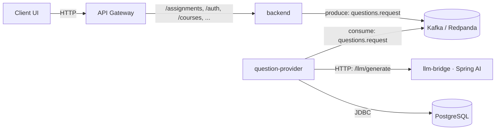

# Edda21 Microservices (Java-only) — Spring Cloud + Kafka (Redpanda) + Postgres + Spring AI

A microservices project for an EdTech-like platform.  
It uses:

- **Spring Cloud** patterns: Config Server, Eureka Service Registry, API Gateway.
- **Kafka** (via **Redpanda**) for async communications between services.
- **PostgreSQL** for persistent storage with **Flyway** migrations.
- **Spring AI** (Java) as an LLM bridge (no Python). Supports **MOCK** and **OpenAI** modes.

---

## 1) Project description

Edda21 is a compact Java-based microservices system that integrates Large Language Models (LLMs) into an EdTech scenario
for automatic question generation, with a strong focus on clean architecture and transparent infrastructure.

The **LLM bridge** service (`llm-bridge`) is built on **Java** and **Spring Boot**, using a **hexagonal
(ports-and-adapters) architecture** to separate domain logic from technical details. Core domain workflows depend on
small, explicit interfaces (ports), while all framework-specific and infrastructure code lives in adapters.

Integration with the LLM is handled through **Spring AI**. The `ChatExecutor` port defines a thin abstraction over
the Spring AI client:

```java
String execute(String system, String user, OpenAiChatOptions options);
````

This hides the concrete LLM client and configuration from the rest of the application. Application services construct
the system/user prompts and options (model, temperature, etc.) and delegate to `ChatExecutor`. Because only this
interface is visible to the domain/application layer, it is easy to switch the underlying LLM provider or mock it in tests.

Question generation itself is represented by the `QuestionGeneratorClient` port. This interface models a high-level
operation:

```java
List<QuestionDTO> generate(
    String subject,
    String topic,
    String difficulty,
    QuestionType qtype,
    int count,
    String locale);
```

Implementations of `QuestionGeneratorClient` may use LLMs via `ChatExecutor`, rule-based logic, or external HTTP APIs.
From the perspective of the rest of the system, they are just “question generators” that return structured `QuestionDTO`
objects for a given assignment configuration.

On the write side, persistence in the **question-provider** service is exposed through the `QuestionWritePort`. The
concrete adapter is `QuestionRepo`, a **plain JDBC** implementation built on **NamedParameterJdbcTemplate**. It
intentionally does not use JPA/Hibernate: all SQL is explicit, and the mapping between domain data and database schema
is easy to inspect. `QuestionRepo` inserts each generated question into a `question` table and then links it to an
assignment using an `assignment_question` join table. The method is annotated with `@Transactional`, ensuring that both
inserts for each question (and the entire batch) are executed in a single database transaction. If one insert fails
(for example, because of a `NOT NULL` constraint on `body`), the transaction is rolled back and no partial data is
committed.

Database schema management is handled by **Flyway**. Migrations define the `question` and `assignment_question` tables
(and other tables like `question_generation_session`) and can introduce constraints (such as mandatory columns) that
are directly used in integration tests. The combination of Flyway + plain JDBC gives a clear, migration-driven schema
with simple SQL-focused repositories.

The project includes **Spring-based integration tests** that exercise the full stack: Flyway migrations, JDBC
repositories, and transaction management. A typical test creates an assignment ID, attempts to insert a batch of two
questions where one is invalid (e.g., missing `body`), expects a `DataIntegrityViolationException`, and then verifies
via `SELECT count(*)` that both `question` and `assignment_question` tables remain empty. This validates that
`@Transactional` semantics around `QuestionRepo.saveQuestions` work as intended.

In terms of structure and dependencies:

* **Domain / application layer** depends only on:

    * `QuestionGeneratorClient` (port for LLM-based generators),
    * `QuestionWritePort` (port for persistence),
    * `ChatExecutor` (port for low-level LLM calls).

* **Infrastructure / adapter layer** provides:

    * Spring AI–based implementation of `ChatExecutor`,
    * JDBC-based implementation of `QuestionWritePort` (`QuestionRepo`),
    * Concrete generator implementations that compose `ChatExecutor` and map LLM responses to `QuestionDTO`,
    * REST controllers and Kafka listeners that expose use cases externally.

Together, these components form a small, focused LLM-powered EdTech backend: LLMs are integrated through Spring AI,
persistence goes through JDBC and Flyway, and the overall design uses ports-and-adapters to keep the core logic
framework-agnostic, testable, and easy to extend.

---

## 2) High-Level Architecture



**Key idea:** the instructor-facing **backend** does not block on LLM calls. It publishes a message to Kafka and
can immediately return `202 Accepted` (or similar). The **question-provider** consumes messages, optionally mixes in
“bank” questions from DB, calls **llm-bridge** when needed, and persists results to **Postgres**. The status of
question generation is tracked in a `question_generation_session` table and exposed via REST endpoints so that the UI
can poll for completion.

---

## 3) Repository Structure

```text
.
├─ docker-compose.yml                  # Orchestrates all services locally
├─ config-repo/
│  └─ api-gateway-docker.yml           # Gateway routes while in docker profile
├─ platform/
│  ├─ service-registry/                # Eureka server (com.edda21.*)
│  ├─ config-server/                   # Spring Cloud Config (native / file-based)
│  └─ api-gateway/                     # Spring Cloud Gateway
└─ services/
   ├─ backend/                         # REST API for instructors/students; publishes Kafka messages
   ├─ question-provider/               # Kafka consumer; persists to Postgres; Flyway migrations
   └─ llm-bridge/                      # Spring AI; MOCK or OpenAI
```

### 3.1. Package layout (Ports & Adapters)

#### 3.1.1. `llm-bridge`

```text
com.edda21.llm
  ├─ LlmBridgeApp                          # Spring Boot application
  ├─ domain/
  │   ├─ model/                            # QuestionDTO, QuestionType, Difficulty
  │   ├─ dto/                              # QuestionSetDTO
  │   └─ port/
  │       └─ out/                          # QuestionGeneratorClient, ChatExecutor
  ├─ application/
  │   ├─ GenerationService                 # orchestrates question generation
  │   └─ PromptService                     # builds prompts for LLM calls
  ├─ shared/
  │   ├─ LlmConstants                      # common constants (model names, etc.)
  │   └─ json/
  │       ├─ JsonMini                      # small JSON helper
  │       └─ JsonUtil                      # JSON utilities for DTOs
  └─ adapter/
      ├─ in/
      │   └─ web/                          # QuestionGenerationController (HTTP API)
      └─ out/
          ├─ llm/                          # SpringAiQuestionGeneratorClient, SpringAiChatExecutor
          └─ stub/                         # StubQuestionGeneratorClient
```

#### 3.1.2. `question-provider`

```text
com.edda21.qp
  ├─ QpApp                                  # Spring Boot application
  ├─ domain/
  │   └─ port/
  │       └─ out/                           # QuestionWritePort (persistence abstraction)
  ├─ application/
  │   └─ llm/
  │       └─ LlmResultProcessorService      # processes LLM responses: insert questions, update session
  └─ adapter/
      ├─ in/
      │   └─ messaging/
      │       └─ kafka/
      │           ├─ KafkaConsumerCfg       # consumer configuration
      │           ├─ QuestionListener       # (if used) other Kafka listeners
      │           ├─ LlmResponseKafkaListener
      │           ├─ LlmQuestionsResponsePayload
      │           └─ LlmQuestionDto
      └─ out/
          └─ persistence/
              └─ QuestionRepo               # plain JDBC implementation of QuestionWritePort
```

#### 3.1.3. `backend`

```text
com.edda21.backend
  ├─ BackendApp                             # Spring Boot application
  ├─ domain/
  │   └─ model/
  │       ├─ QuestionGenerationSession      # domain representation of session (if used)
  │       ├─ QuestionGenerationSessionStatus
  │       ├─ QuestionSourceMode             # DB_ONLY, DB_THEN_LLM, LLM_ONLY
  │       └─ UserRole                       # INSTRUCTOR, STUDENT, ADMIN, ...
  ├─ application/
  │   ├─ auth/
  │   │   ├─ AuthUser                       # authenticated user view
  │   │   └─ UserAuthService                # DB-based auth, maps to roles/persons
  │   ├─ context/
  │   │   ├─ InstructorContextService       # extracts instructorId from JWT
  │   │   └─ StudentContextService          # extracts studentId from JWT
  │   └─ question/
  │       ├─ QuestionGenerationSessionService
  │       └─ QuestionSelectionService       # selects existing questions from DB
  └─ adapter/
      ├─ in/
      │   └─ web/
      │       ├─ auth/
      │       │   └─ AuthController         # login endpoint → JWT
      │       ├─ assignment/
      │       │   └─ AssignmentController   # assignment endpoints
      │       └─ question/
      │           ├─ QuestionGenerationSessionController
      │           ├─ QuestionGenerationSessionCreateRequest
      │           └─ QuestionGenerationSessionResponse
      └─ out/
          ├─ security/
          │   ├─ SecurityConfig             # Spring Security, JWT resource server
          │   └─ JwtTokenService            # generates tokens with role/instructorId/studentId
          ├─ messaging/
          │   └─ kafka/
          │       ├─ KafkaProducerCfg       # producer configuration
          │       ├─ QuestionsRequestProducer
          │       └─ QuestionGenerationRequestPayload
          └─ persistence/
              └─ jpa/
                  └─ QuestionGenerationSessionRepository
```

> All `@SpringBootApplication` classes scan `com.edda21` so all adapters and application/domain components are picked up automatically.

---

## 4) Prerequisites

* **Java 21**, **Gradle 8+**
* **Docker** + **Docker Compose**
* Optional: `psql` client (for manual DB checks)

**Ports in use (typical setup):**

* 8080 — API Gateway
* 8761 — Eureka
* 8888 — Config Server
* 8082 — backend
* 8083 — question-provider
* 8098 — llm-bridge
* 9092 — Kafka / Redpanda
* 5432 — Postgres

---

## 5) Build & Packaging

From the repository root:

```bash
# Build JARs
./gradlew \
  :services:backend:bootJar \
  :services:question-provider:bootJar \
  :services:llm-bridge:bootJar \
  :platform:api-gateway:bootJar \
  :platform:service-registry:bootJar \
  :platform:config-server:bootJar

# Build Docker images (tags unified to edda21/*)
docker build -t edda21/backend:dev            -f services/backend/Dockerfile .
docker build -t edda21/question-provider:dev  -f services/question-provider/Dockerfile .
docker build -t edda21/llm-bridge:dev         -f services/llm-bridge/Dockerfile .
docker build -t edda21/api-gateway:dev        -f platform/api-gateway/Dockerfile .
docker build -t edda21/service-registry:dev   -f platform/service-registry/Dockerfile .
docker build -t edda21/config-server:dev      -f platform/config-server/Dockerfile .
```

> For the minimal “LLM flow”, you mostly need `backend`, `question-provider`, `llm-bridge` plus the platform trio
> (`config-server`, `service-registry`, `api-gateway`) when routing via gateway.

---

## 6) Configuration

### 6.1. Docker Compose Environment

`docker-compose.yml` defines environment variables with sensible defaults:

* **Kafka / Redpanda**: broker at `redpanda:9092` inside the compose network.
* **Postgres**:

    * `POSTGRES_DB=edtech`
    * `POSTGRES_USER=postgres`
    * `POSTGRES_PASSWORD=postgres`
* **LLM Bridge**:

    * `LLM_MODE=MOCK` by default.
    * For OpenAI:

        * `LLM_MODE=OPENAI`
        * `SPRING_AI_OPENAI_API_KEY=<your_key>`
        * `SPRING_AI_MODEL=gpt-4o-mini` (or another supported model).

### 6.2. Gateway Routes (Config Server)

`config-repo/api-gateway-docker.yml` (mounted to config-server) enables routes like:

```yaml
spring:
  cloud:
    gateway:
      routes:
        - id: backend
          uri: lb://backend
          predicates: [ Path=/assignments/**, /auth/**, /courses/** ]
        - id: question-provider
          uri: lb://question-provider
          predicates: [ Path=/qp/** ]
```

> This uses **Eureka** to resolve `lb://serviceId`.

---

## 7) Run the Stack

```bash
# Start everything
docker compose up -d

# Check containers
docker compose ps
```

(Optional) Explicitly create topics on Redpanda (if you prefer manual creation):

```bash
docker compose exec redpanda rpk topic create questions.request questions.response questions.dlq
```

**Health checks / UIs:**

* Eureka: [http://localhost:8761](http://localhost:8761)
* API Gateway: [http://localhost:8080](http://localhost:8080)
* LLM Bridge (MOCK default): [http://localhost:8098/actuator/health](http://localhost:8098/actuator/health)

---

## 8) Test the Flow (Example)

> Exact URLs and payloads will depend on the current controller mappings; this is a conceptual sketch.

1. Authenticate as instructor:

```bash
curl -X POST http://localhost:8080/auth/login \
  -H "Content-Type: application/json" \
  -d '{"username":"instructor1","password":"secret"}'
```

Receive a JWT with `role=INSTRUCTOR` and `instructorId` claim.

2. Create a question generation session for an assignment:

```bash
ASSIGNMENT_ID=00000000-0000-0000-0000-000000000001

curl -X POST "http://localhost:8080/api/sessions" \
  -H "Authorization: Bearer $TOKEN" \
  -H "Content-Type: application/json" \
  -d '{
        "assignmentId": "'"$ASSIGNMENT_ID"'",
        "requestedCount": 5,
        "sourceMode": "DB_THEN_LLM",
        "subject": "MATH",
        "topic": "algebra"
      }'
```

Expected response (shape may differ in code):

```json
{
  "sessionId": "d9c9e51e-...-...",
  "status": "PENDING",
  "requestedCount": 5
}
```

3. Backend:

* inserts `question_generation_session` row,
* selects questions from DB (if `DB_ONLY` or `DB_THEN_LLM`),
* if more questions are needed from LLM, produces `QuestionGenerationRequestPayload` to `questions.request`.

4. Question-provider / llm-bridge:

* consumes `questions.request`,
* calls `llm-bridge /llm/generate`,
* persists questions,
* updates `question_generation_session` with `llm_generated_count`, `status`, `result_code`.

5. Poll session status:

```bash
curl -X GET "http://localhost:8080/api/sessions/{sessionId}" \
  -H "Authorization: Bearer $TOKEN"
```

Response eventually becomes (example):

```json
{
  "sessionId": "d9c9e51e-...-...",
  "status": "COMPLETED",
  "requestedCount": 5,
  "dbSelectedCount": 2,
  "llmGeneratedCount": 3,
  "resultCode": "OK_FULL"
}
```

---

## 9) Switching LLM Modes

* **MOCK** mode (default) requires no external credentials and returns deterministic data.
* **OpenAI** mode:

    * In `docker-compose.yml` for `llm-bridge`:

      ```yaml
      environment:
        - LLM_MODE=OPENAI
        - SPRING_AI_OPENAI_API_KEY=your_api_key
        - SPRING_AI_MODEL=gpt-4o-mini
      ```

    * Restart only the LLM bridge:

      ```bash
      docker compose up -d --force-recreate llm-bridge
      ```

The `question-provider` always calls `llm-bridge` over HTTP and accepts the same JSON shape.

---

## 10) Scaling Consumers

Simulate a consumer group with multiple instances:

```bash
docker compose up -d --scale question-provider=3
```

Kafka will assign partitions to instances in the same group (e.g. `question-provider-group`).

Per-instance concurrency can also be increased in Spring Kafka configuration (e.g. `concurrency = 2`), resulting in
total parallelism = `instances × concurrency`.

---

## 11) Troubleshooting

* **Gateway 404**: ensure Eureka and Config Server are up. Gateway relies on config server for routes and on Eureka to
  discover instances.
* **Kafka connection errors**: verify `redpanda` is healthy and exposed on `9092` inside the compose network.
* **Postgres auth**: defaults are set in compose; check `JDBC_URL`, `JDBC_USER`, `JDBC_PASS` envs in
  `question-provider` and `backend`.
* **LLM Bridge errors**: in `MOCK` mode it should always work; for `OPENAI` verify your API key and model
  (`SPRING_AI_MODEL`).

---

## 12) Database Summary (example)

**Tables (subset for question flow)**

* `question(id uuid PK, source, subject, difficulty, body, correct, ... )`
* `assignment(id uuid PK, course_id uuid, title, ...)`
* `assignment_question(assignment_id, question_id, variant, points, ordering)`
* `question_generation_session(id uuid PK, assignment_id, requested_count, db_selected_count, llm_generated_count, status, result_code, ...)`
* `answer(id uuid PK default gen_random_uuid(), assignment_id, question_id, student_id, score, answered_at)`

**View (optional example)**

* `v_course_progress` (analytics using CTE + window functions)

Example query:

```sql
select * from v_course_progress
order by accuracy desc nulls last, total_answered desc
limit 20;
```

---

## 13) Suggested Extensions

* Add **Resilience4j** (`@Retry`, `@CircuitBreaker`) to the HTTP call from `question-provider` → `llm-bridge`.
* Add a **DLQ** (e.g. `questions.dlq`) and forward messages on parsing/validation failures.
* Implement **Outbox** pattern in `backend` for reliable publish-after-DB-change.
* Create **materialized views** for reporting dashboards and KPIs.
* Add **JWT** auth at the **Gateway** and propagate identity to services (Spring Security).
* Extend question generation to support multiple LLM providers (OpenAI, local models, etc.) behind the same ports.

---

## 14) Clean Up

```bash
docker compose down        # stop containers
docker compose down -v     # also remove Postgres data volume
```
