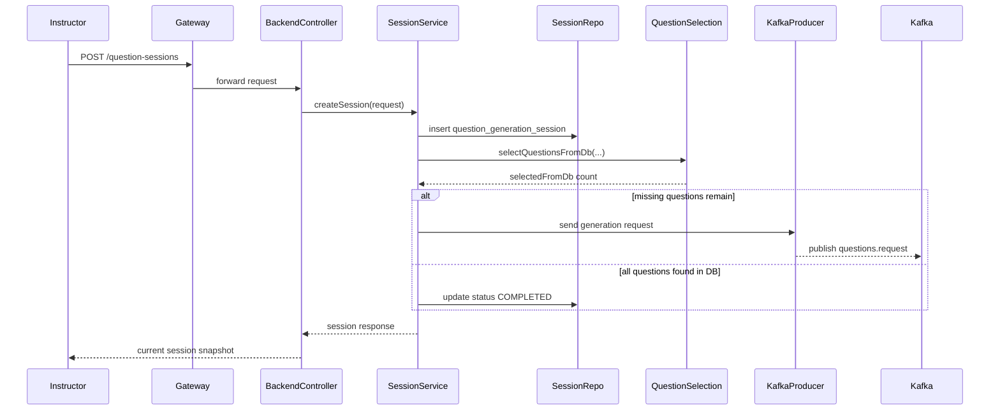
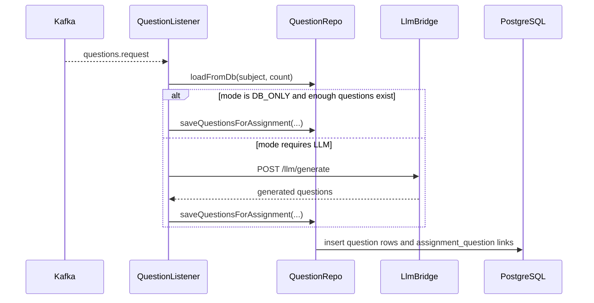
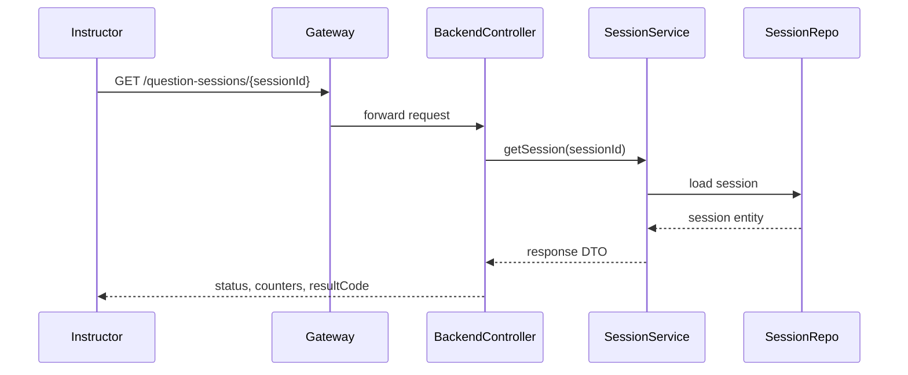
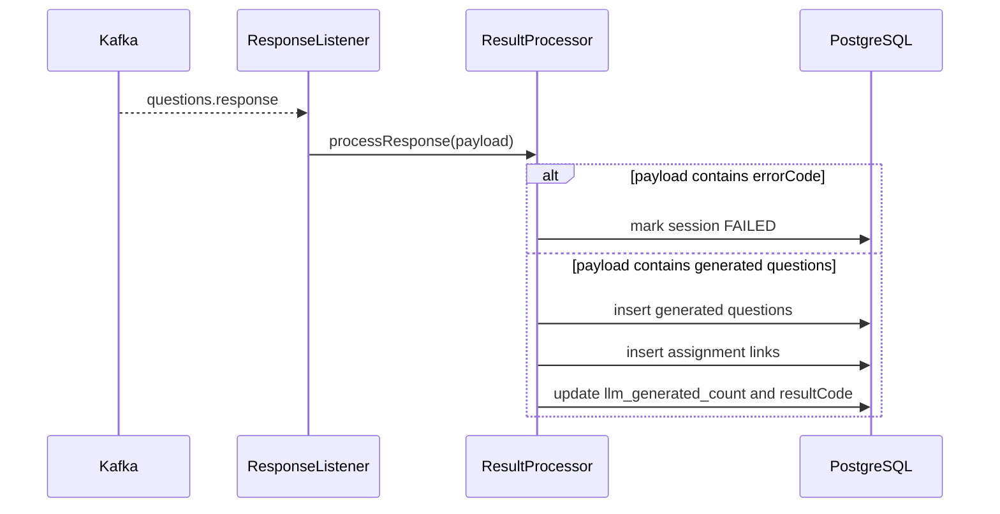

# Runtime Flows

## Create question generation session

## Consume generation request and call LLM bridge

## Read session status

## Process LLM response payload and finalize a session

## Notes on the current state

- The session-based orchestration flow is the clearest business flow in the backend service.
- The question-provider service also contains a direct request-consumer flow that calls the LLM bridge by HTTP.
- The response-topic processing flow is represented in code and tests, but the upstream publisher side is still less explicit than the direct HTTP path.
- The documentation therefore treats the repository as a generation-focused system that is still converging on one end-to-end asynchronous design.
